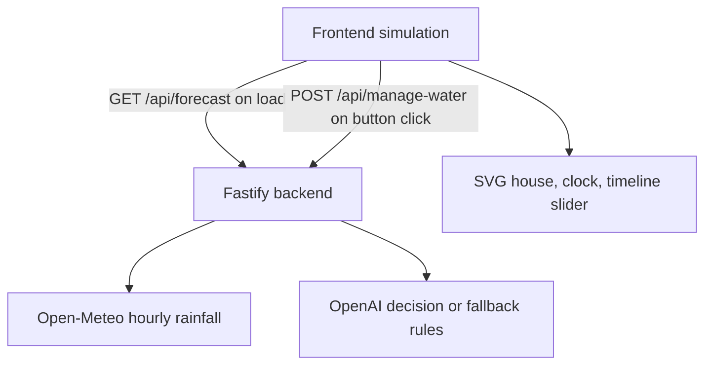
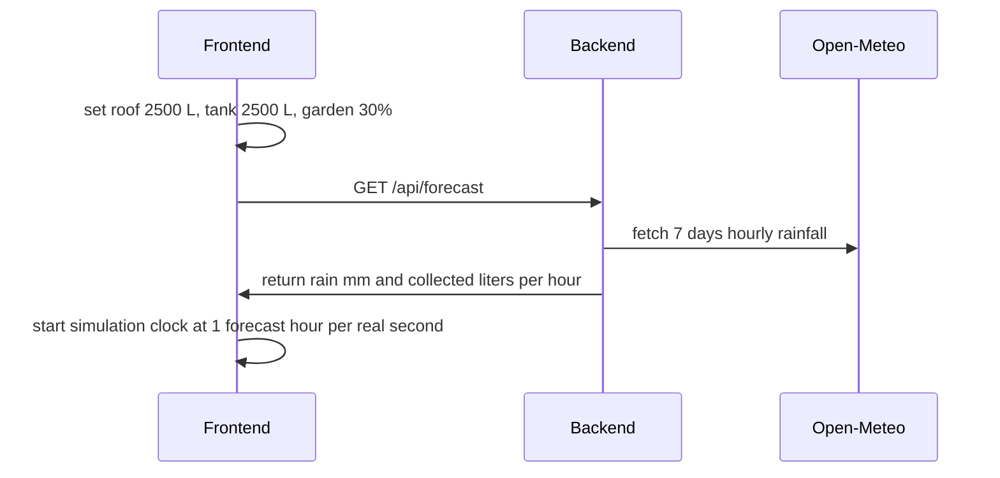
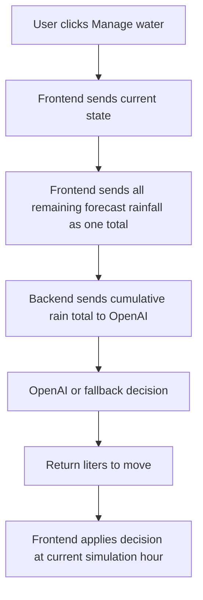

# Smart Home Water MVP - Logic Flow

This file documents the simplified app flow.

## Main Blocks

## Startup Flow

## Simulation Rules

- Roof capacity is `5000 L`.
- Garden tank capacity is `5000 L`.
- Roof surface is `100 m2`, so `1 mm` rain adds `100 L` to roof storage.
- Roof storage evaporates `5 L/hour`.
- Garden humidity decreases `1%` every third dry forecast hour.
- Garden humidity increases `3%/hour` when it rains.
- Releasing `100 L` from the garden tank to soil increases garden humidity by `1%`.
- The timeline slider is a read-only live progress indicator.

## Manage Water Flow

The AI receives:

- current simulation time
- roof water liters
- garden tank liters
- garden soil humidity
- cumulative remaining rainfall

The AI returns:

- `targetRoofLiters`
- `roofToGardenTankLiters`
- `gardenTankToSoilLiters`
- `reasoning`

The decision goal is to keep garden soil at least `40%`, preserve at least `500 L` on the roof, and anticipate rain that may fill the roof.
